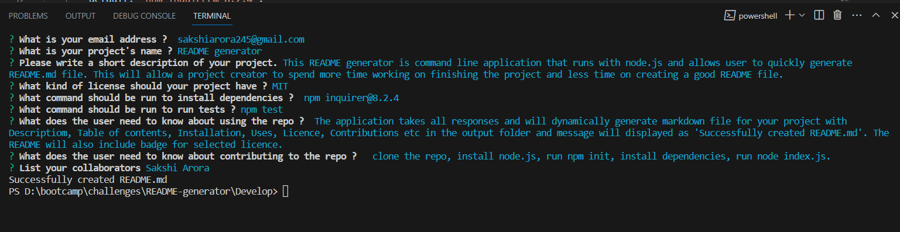

# Professional README Generator

## Description

README file is important part of any application. It contains quality information of the app like What the app is for, how to install the required tools, how to use the app, how to make contibutions to improve the efficiency of the application.

This README generator is command line application that runs with node.js and allows user to dynamically generate README.md file with Descriptiom, Table of contents, Installation, Uses, Licence, Contributions etc based upon the input entered in regard to questions prompted. This README file generator displays licence badge at top of the file. This will allow a project creator to spend more time working on finishing the project and less time on creating a good README.

## Table of Contents

- [Installation](#installation)
- [Usage](#usage)
- [Contribution](#contribution)
- [Credits](#credits)
- [Contact Information](#contact-information) 

## Installation

A little intro about the installation.

1. Clone the Repository from GitHub
   ```
   git clone git@github.com:sakshiarora04/README-Generator.git
   ```
2. Install Node.js then Open terminal and run command
   ```
   npm init
   ```
3. To install required dependencies, run the following command :

   ```
   npm inquirer@^8.2.4
   ```

4. In the end, run command-
   ```
   node index.js
   ```

## Usage

When user runs node index.js command after opening integrated terminal on right clicking the repo folder, the application prompts the series of questions related to application repository and also asks about github username and email id using the inquirer package.

The application then takes all responses and will dynamically generate high quality markdown file for your project with Descriptiom, Table of contents, Installation, Uses, Licence, Contributions etc in the output folder and message will displayed as 'Successfully created README.md'. If user doesn't answer the question related to install dependencies and run test then it will display default answers otherwise for all other inputs if question is not answered it will pass empty string and displays nothing on that section. The README will also include badge for selected licence.

Link to walkthrough video in google drive:

https://drive.google.com/file/d/1Ve4nlMDyGd3w2wrMK1C_G1Jt82kZqZ35/view?usp=drive_link

Link to walkthrough video in Screencastify:

https://app.screencastify.com/manage/videos/osMqjiNpfEkVuR1FJix4

The following images show the application's appearance and functionality :

* Command line



* Sample readme


* Walkthrough


## Contribution

To contribute to this application, email me at sakshiarora245@gmail.com.
Here are the steps needed for doing that:

- Fork the repo
- Create a feature branch (git checkout -b NAME-HERE)
- Add stages (git add .)
- Commit your new feature (git commit -m 'Add some feature')
- Push your branch (git push)
- Create a new Pull Request

After reviewing, your feature branch will be merged.

## Credits

References:

https://shields.io/badges

https://www.markdownguide.org/cheat-sheet/

https://coding-boot-camp.github.io/full-stack/github/professional-readme-guide

## Contact Information

Github Username: [sakshiarora04](https://github.com/sakshiarora04)

Email id: sakshiarora245@gmail.com
